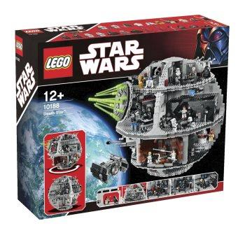

Pipelines in R
========================================================
autosize: true
author: Tristan Mahr, @tjmahr
date: March 18, 2015
css: assets/custom.css

Madison R Users Group

Repository for this talk: https://github.com/tjmahr/MadR_Pipelines


Scientific Computing
========================================================
incremental: true

I'm interested in:

* correctness
    - but not necessarily robustness against corner-cases
* optimizing for human readers
    - collaborators, including me in the future
* reproducibility
* automation


Make bricks, not monoliths
========================================================

I tackle these goals by building a problem-specific
language from simpler, understandable pieces of code.



(But see also [Best Practices for Scientific Computing](http://journals.plos.org/plosbiology/article?id=10.1371/journal.pbio.1001745)
for more tools and strategies.)


Working with bricks
========================================================
incremental: true

1. Develop a core vocabulary of functions.
    - including others' functions/packages.
2. Construct your own functions on top of that core.
3. Continue upwards.


Vocabulary
========================================================

- [R Vocabulary](http://adv-r.had.co.nz/Vocabulary.html)
- [Awesome R](https://github.com/qinwf/awesome-R)
- Packages that do one thing very well: `dplyr`, `stringr`,
  `lubridate`, `broom`, `tidyr`,  `rvest`


Pause to demonstrate any requested functions
========================================================
type: prompt


```r
a_to_f <- head(letters)
a_to_f
tail(letters)
seq_along(a_to_f)
xs <- seq_len(10)
xs
ifelse(xs %% 2 == 0, xs, NA)
```


Functions Are Great
========================================================
incremental: true

Solve a problem once, then re-use that solution elsewhere.


```r
# Squish values into a range
squish <- function(xs, lower, upper) {
  xs[xs < lower] <- lower
  xs[upper < xs] <- upper
  xs
}
squish(rnorm(5), -.3, 1)
```

```
[1]  1.0000000 -0.3000000  0.7980856
[4] -0.3000000  0.2153025
```


Bootstrap from many smaller functions
========================================================
incremental: true

Create my own problem-specific language.


```r
# Insert values into the second-to-last
# position, in case last one is a delimiter
insert_line <- function(xs, ys) {
  c(but_last(xs), ys, last(xs))
}
```


```r
but_last <- function(...) head(..., n = -1)
last <- function(...) tail(..., n = 1)
```


```r
insert_line(c("x", "y", "z"), "&")
```

```
[1] "x" "y" "&" "z"
```


But readability quickly slips away.
========================================================
incremental: true

Here's a function adapted from the `strsplit` help page.


```r
mystery_func <- function(xs) {
  sapply(lapply(strsplit(xs, NULL), rev),
         paste, collapse = "")
}
```

Okay, maybe it would help if it were built out of
understandable chunks.


With chunks!
========================================================
incremental: true

"Extract function" refactoring


```r
str_tokenize <- function(xs) {
  strsplit(xs, split = NULL)
}

str_collapse <- function(..., joiner = "") {
  paste(..., collapse = joiner)
}
```


```r
mystery_func <- function(xs) {
  sapply(lapply(str_tokenize(xs), rev),
         str_collapse)
}
```

Okay, maybe it would help if it weren't a one-liner


Un-nest the function calls
========================================================
incremental: true

Do one thing per line.


```r
mystery_func <- function(xs) {
  char_sets <- str_tokenize(xs)
  char_sets_rev <- lapply(char_sets, rev)
  sapply(char_sets_rev, str_collapse)
}
```

Pretty good, but now we have these intermediate values we don't care
about cluttering things up.


Pipelines to the rescue
========================================================
type: section


A way to express successive data transformations.


Basic Idea
========================================================
incremental: true

Use the value on the left-hand side as the first argument
to the function on the right-hand side.


```r
library("magrittr")

# Rule 1
f(xs)
xs %>% f

# Rule 2
g(xs, n = 5)
xs %>% g(n = 5)
```


Chaining pipes together
========================================================
incremental: true

Do function composition by chaining pipes together.


```r
# Rule 3
g(f(xs), n = 5)
xs %>% f %>% g(n = 5)
```

Mentally, read `%>%` as "then".

> Take `xs` _then_ do `f` _then_ do `g` with `n = 5`.


Pipelines: Level 1
========================================================


```r
xs <- rnorm(5)
squish(sort(round(xs, 2)), -.3, 1)
```

```
[1] -0.30 -0.30 -0.27  0.20  0.68
```

```r
xs %>% round(2) %>% sort %>% squish(-.3, 1)
```

```
[1] -0.30 -0.30 -0.27  0.20  0.68
```


You might already use pipelines
========================================================

On the command line:

```
sort data.csv | uniq -u | wc -l
# 369 (number of unique lines)
```

- [Data Science on the Command Line](http://datascienceatthecommandline.com/)
- [Unix Commands for Data Science](http://www.gregreda.com/2013/07/15/unix-commands-for-data-science/)


Method chains are also like pipelines
========================================================
incremental: true

[Python](http://nbviewer.ipython.org/urls/bitbucket.org/hrojas/learn-pandas/raw/master/lessons/06%20-%20Lesson.ipynb)

```
df.groupby(['letter','one']).sum()
```

[Javascript](http://www.w3schools.com/jquery/jquery_chaining.asp)

```
$("#p1")
  .css("color", "red")
  .slideUp(2000)
  .slideDown(2000);
```


Back to the mystery function
========================================================
incremental: true


```r
mystery_func <- function(xs) {
  str_tokenize(xs) %>%
    lapply(rev) %>%
    sapply(str_collapse)
}
```

* Break each string into a vector of characters
* THEN reverse each vector
* THEN collapse each character vector together


```r
words <- c("The", "quick", "brown", "fox")
mystery_func(words)
```

```
[1] "ehT"   "kciuq" "nworb" "xof"  
```


Pause for questions
========================================================
type: prompt


. - the placeholder
========================================================
type: section


What if the input should not be the first argument?
========================================================
incremental: true

Use `.` as an argument placeholder.


```r
# Rule 4
f(y, x)
x %>% f(y, .)

# Rule 5
f(y, z = x)
x %>% f(y, z = .)
```

Placeholder says where the piped input should land.


Examples
========================================================


```r
words %>% paste0("~~", ., "~~") %>% toupper
```

```
[1] "~~THE~~"   "~~QUICK~~" "~~BROWN~~"
[4] "~~FOX~~"  
```

```r
# As a named parameter
library("broom")
mtcars %>% lm(mpg ~ cyl * wt, data = .) %>%
  tidy %>% print(digits = 2)
```

```
         term estimate std.error statistic
1 (Intercept)    54.31      6.13       8.9
2         cyl    -3.80      1.01      -3.8
3          wt    -8.66      2.32      -3.7
4      cyl:wt     0.81      0.33       2.5
  p.value
1 1.3e-09
2 7.5e-04
3 8.6e-04
4 2.0e-02
```


Saving pipelines
========================================================
incremental: true

The input to the pipeline can itself be a placeholder!


```r
num_unique <- . %>% unique %>% length
```

In this case, the pipeline describes a function chain that
can be saved and re-used. It also has a different print method.


```r
num_unique
```

```
Functional sequence with the following components:

 1. unique(.)
 2. length(.)

Use 'functions' to extract the individual functions. 
```


Final mystery_func
========================================================


```r
mystery_func <- . %>%
  str_tokenize %>%
  lapply(rev) %>%
  sapply(str_collapse)

mystery_func(words)
```

```
[1] "ehT"   "kciuq" "nworb" "xof"  
```


That's most of it.
========================================================
incremental: true

The pipe `%>%` and placeholder `.` covers 90% of magrittr.

What didn't I cover?

* aliases (pipeline-friendly forms of functions like `[`, `$`, `[[`)
* compound assignment `%<>%` (sugar for `x <- x %>% ...` )
* tee `%T>%` (print, plot, save results during pipeline
  without interrupting the flow of data)
* exposition `%$%` (like `with` as an infix)
* braced expressions (arbitrary blocks of code in a pipeline)

See the [magrittr vignette](http://cran.r-project.org/web/packages/magrittr/vignettes/magrittr.html).

Next sections
========================================================

Basic scheme:

* Build or borrow a set of functions to work on a problem
* Chain the functions together into an understandable pipeline

Next set of slides: [`dplyr` for data-frames](http://rpubs.com/tjmahr/dplyr_2015).

